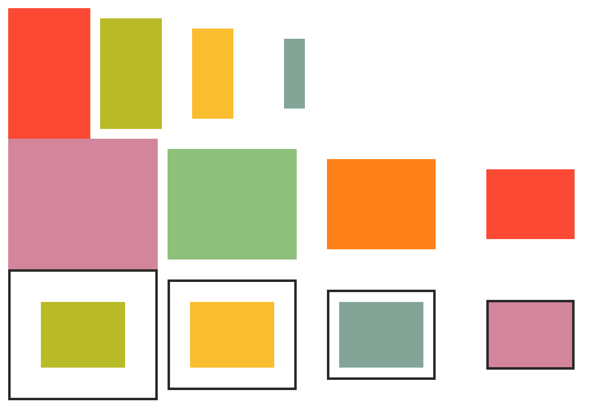

## Output



## Code

```php
<?php

require 'vendor/autoload.php';

use Kehet\ImagickLayoutEngine\Containers\ColumnContainer;
use Kehet\ImagickLayoutEngine\Containers\RowContainer;
use Kehet\ImagickLayoutEngine\Items\Rectangle;

$width = 1500;
$height = 1000;

// Create a new image

$imagick = new Imagick;
$imagick->newImage($width, $height, new ImagickPixel('white'));

// Create a root container

$root = new ColumnContainer;
$root->setPadding(20); // padding top=20, right=20, bottom=20, left=20

// Add subcontainers into the root container

// Row 1

$row = new RowContainer;
$row->addItem(
    (new Rectangle(draw(fill: '#fb4934')))->setPadding(0),
    forceSize: 200
);
$row->addItem(
    (new Rectangle(draw(fill: '#b8bb26')))->setPadding(25),
    forceSize: 200
);
$row->addItem(
    (new Rectangle(draw(fill: '#fabd2f')))->setPadding(50),
    forceSize: 200
);
$row->addItem(
    (new Rectangle(draw(fill: '#83a598')))->setPadding(75),
    forceSize: 200
);
$root->addItem($row);

// Row 2

$row = new RowContainer;
$row->addItem(
    (new Rectangle(draw(fill: '#d3869b')))->setMargin(0)
);
$row->addItem(
    (new Rectangle(draw(fill: '#8ec07c')))->setMargin(25)
);
$row->addItem(
    (new Rectangle(draw(fill: '#fe8019')))->setMargin(50)
);
$row->addItem(
    (new Rectangle(draw(fill: '#fb4934')))->setMargin(75)
);
$root->addItem($row);

// Row 3

$border = draw(stroke: '#282828', strokeWidth: 5);

$row = new RowContainer;
$row->addItem(
    (new Rectangle(draw(fill: '#b8bb26')))
        ->setBorder($border)
        ->setMargin(0)
        ->setPadding(75)
);
$row->addItem(
    (new Rectangle(draw(fill: '#fabd2f')))
        ->setBorder($border)
        ->setMargin(25)
        ->setPadding(50)
);
$row->addItem(
    (new Rectangle(draw(fill: '#83a598')))
        ->setBorder($border)
        ->setMargin(50)
        ->setPadding(25)
);
$row->addItem(
    (new Rectangle(draw(fill: '#d3869b')))
        ->setBorder($border)
        ->setMargin(75)
        ->setPadding(0)
);
$root->addItem($row);

// Draw container onto image

$root->draw($imagick, 0, 0, $width, $height);

// Output image as png to file

$imagick->setImageFormat('png');
$imagick->writeImage(__DIR__ . '/02-containers.png');
```
