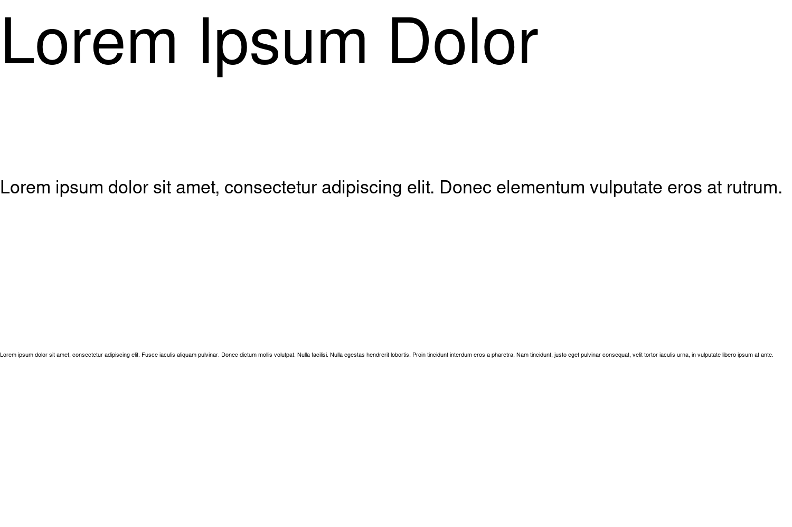

```php
<?php

use Kehet\ImagickLayoutEngine\Containers\RowContainer;
use Kehet\ImagickLayoutEngine\Items\Text;

$width = 1500;
$height = 1000;

// Create new image with white background

$imagick = new Imagick;
$imagick->newImage($width, $height, new ImagickPixel('white'));

// Define root container

$frame = new ColumnContainer;
$frame->addItem(
    new Text(
        draw(fill: 'black'),
        'Lorem Ipsum Dolor',
        initialFontSize: 120,
        minFontSize: 50
    )
);
$frame->addItem(
    new Text(
        draw(fill: 'black'),
        'Lorem ipsum dolor sit amet, consectetur adipiscing elit. Donec elementum vulputate eros at rutrum.'
    )
);
$frame->addItem(
    new Text(
        draw(fill: 'black'),
        'Lorem ipsum dolor sit amet, consectetur adipiscing elit. Fusce iaculis aliquam pulvinar. Donec dictum mollis volutpat. Nulla facilisi. Nulla egestas hendrerit lobortis. Proin tincidunt interdum eros a pharetra. Nam tincidunt, justo eget pulvinar consequat, velit tortor iaculis urna, in vulputate libero ipsum at ante. '
    )
);

// Draw container onto image

$frame->draw($imagick, 0, 0, $width, $height);

// Output image as png to file

$imagick->setImageFormat('png');
$imagick->writeImage(__DIR__.'/text.png');
```

## Output


