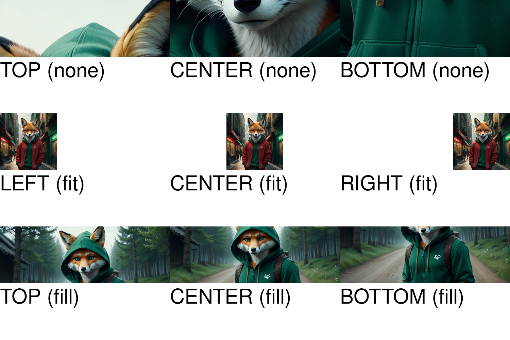

```php
<?php

use Kehet\ImagickLayoutEngine\Containers\RowContainer;
use Kehet\ImagickLayoutEngine\Items\TextWrap;

function createGravityDemoContainer(string $imagePath, Gravity $gravity, string $label, ImageMode $mode): ColumnContainer
{
    $container = new ColumnContainer;
    $container->addItem(new Image($imagePath, $mode, $gravity));
    $container->addItem(new Text(draw(fill: 'black'), $label));

    return $container;
}

$width = 1500;
$height = 1000;

$smallImage = __DIR__.'/example-image-small.jpeg';
$largeImage = __DIR__.'/example-image-large.jpeg';

// Create new image with white background

$imagick = new Imagick;
$imagick->newImage($width, $height, new ImagickPixel('white'));

// Define root container

$root = new ColumnContainer;

$rowFit = new RowContainer;
$rowFit->addItem(createGravityDemoContainer($largeImage, Gravity::TOP, 'TOP (none)', ImageMode::NONE));
$rowFit->addItem(createGravityDemoContainer($largeImage, Gravity::CENTER, 'CENTER (none)', ImageMode::NONE));
$rowFit->addItem(createGravityDemoContainer($largeImage, Gravity::BOTTOM, 'BOTTOM (none)', ImageMode::NONE));
$root->addItem($rowFit);

$rowFit = new RowContainer;
$rowFit->addItem(createGravityDemoContainer($smallImage, Gravity::LEFT, 'LEFT (fit)', ImageMode::FIT));
$rowFit->addItem(createGravityDemoContainer($smallImage, Gravity::CENTER, 'CENTER (fit)', ImageMode::FIT));
$rowFit->addItem(createGravityDemoContainer($smallImage, Gravity::RIGHT, 'RIGHT (fit)', ImageMode::FIT));
$root->addItem($rowFit);

$rowFill = new RowContainer;
$rowFill->addItem(createGravityDemoContainer($largeImage, Gravity::TOP, 'TOP (fill)', ImageMode::FILL));
$rowFill->addItem(createGravityDemoContainer($largeImage, Gravity::CENTER, 'CENTER (fill)', ImageMode::FILL));
$rowFill->addItem(createGravityDemoContainer($largeImage, Gravity::BOTTOM, 'BOTTOM (fill)', ImageMode::FILL));
$root->addItem($rowFill);

// Draw container onto image

$root->draw($imagick, 0, 0, $width, $height);

// Output image as png to file

$imagick->setImageFormat('png');
$imagick->writeImage(__DIR__.'/image-gravity.png');
```

## Output


