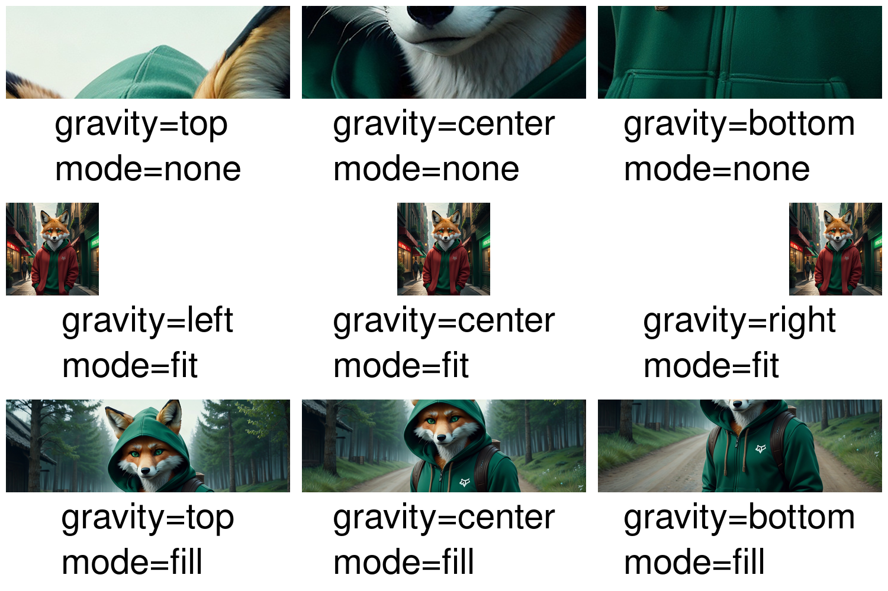

## Output



## Code

```php
<?php

require 'vendor/autoload.php';

use Kehet\ImagickLayoutEngine\Containers\ColumnContainer;
use Kehet\ImagickLayoutEngine\Containers\RowContainer;
use Kehet\ImagickLayoutEngine\Enums\Gravity;
use Kehet\ImagickLayoutEngine\Enums\ImageMode;
use Kehet\ImagickLayoutEngine\Items\Image;
use Kehet\ImagickLayoutEngine\Items\Text;

function createGravityDemoContainer(string $imagePath, Gravity $gravity, ImageMode $mode): ColumnContainer
{
    $container = new ColumnContainer;
    $container->setMargin(10);
    $container->addItem(new Image($imagePath, $mode, $gravity));
    $container->addItem(new Text(
        draw(fill: 'black'),
        sprintf(
            "gravity=%s\nmode=%s",
            $gravity->value,
            $mode->value
        ),
        gravity: Gravity::CENTER
    ));

    return $container;
}

$width = 1500;
$height = 1000;

$smallImage = 'example-image-small.jpeg';
$largeImage = 'example-image-large.jpeg';

// Create new image with white background

$imagick = new Imagick;
$imagick->newImage($width, $height, new ImagickPixel('white'));

// Define root container

$root = new ColumnContainer;

$row1 = new RowContainer;
$row1->addItem(createGravityDemoContainer($largeImage, Gravity::TOP, ImageMode::NONE));
$row1->addItem(createGravityDemoContainer($largeImage, Gravity::CENTER, ImageMode::NONE));
$row1->addItem(createGravityDemoContainer($largeImage, Gravity::BOTTOM, ImageMode::NONE));
$root->addItem($row1);

$row2 = new RowContainer;
$row2->addItem(createGravityDemoContainer($smallImage, Gravity::LEFT, ImageMode::FIT));
$row2->addItem(createGravityDemoContainer($smallImage, Gravity::CENTER, ImageMode::FIT));
$row2->addItem(createGravityDemoContainer($smallImage, Gravity::RIGHT, ImageMode::FIT));
$root->addItem($row2);

$row3 = new RowContainer;
$row3->addItem(createGravityDemoContainer($largeImage, Gravity::TOP, ImageMode::FILL));
$row3->addItem(createGravityDemoContainer($largeImage, Gravity::CENTER, ImageMode::FILL));
$row3->addItem(createGravityDemoContainer($largeImage, Gravity::BOTTOM, ImageMode::FILL));
$root->addItem($row3);

// Draw container onto image

$root->draw($imagick, 0, 0, $width, $height);

// Output image as png to file

$imagick->setImageFormat('png');
$imagick->writeImage(__DIR__ . '/06-image-gravity.png');
```
