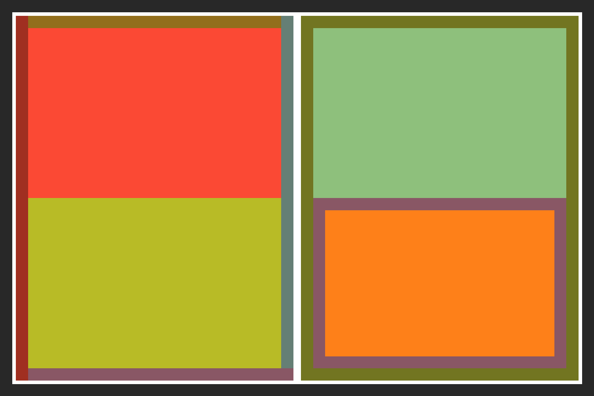

## Output



## Code

```php
<?php

require 'vendor/autoload.php';

use Kehet\ImagickLayoutEngine\Containers\ColumnContainer;
use Kehet\ImagickLayoutEngine\Containers\RowContainer;
use Kehet\ImagickLayoutEngine\Items\Rectangle;

$width = 1500;
$height = 1000;

// Create new image with white background

$imagick = new Imagick;
$imagick->newImage($width, $height, new ImagickPixel('white'));

// Define root container

$root = new RowContainer;
$root->setBorder(draw(stroke: '#282828', strokeWidth: 30));

// Create first column
$column1 = new ColumnContainer;
$column1->setMargin(10);
$column1->addItem(new Rectangle(draw(fill: '#fb4934')));
$column1->addItem(new Rectangle(draw(fill: '#b8bb26')));
$column1->setBorderTop(draw(stroke: '#926E1C', strokeWidth: 30));
$column1->setBorderRight(draw(stroke: '#657F75', strokeWidth: 30));
$column1->setBorderBottom(draw(stroke: '#895765', strokeWidth: 30));
$column1->setBorderLeft(draw(stroke: '#A02F21', strokeWidth: 30));
$root->addItem($column1);

// Create second column
$column2 = new ColumnContainer;
$column2->setMargin(10);
$column2->addItem(new Rectangle(draw(fill: '#8ec07c')));
$column2->addItem(
    (new Rectangle(draw(fill: '#fe8019')))
        ->setBorder(draw(stroke: '#895765', strokeWidth: 30))
);
$column2->setBorder(draw(stroke: '#727521', strokeWidth: 30));
$root->addItem($column2);

// Draw container onto image
$root->draw($imagick, 0, 0, $width, $height);

// Output image as png to file

$imagick->setImageFormat('png');
$imagick->writeImage(__DIR__.'/07-border.png');
```
