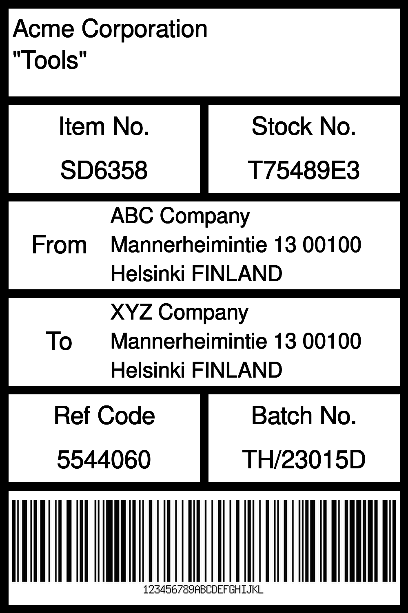

```php
<?php

use Kehet\ImagickLayoutEngine\Containers\RowContainer;
use Kehet\ImagickLayoutEngine\Items\Rectangle;


$width = 1000;
$height = 1500;

// Create new image
$imagick = new Imagick;
$imagick->newImage($width, $height, new ImagickPixel('white'));

$root = new ColumnContainer;
$root->setBorder(draw(stroke: 'black', strokeWidth: 10));

// row 1
$title = new Text(draw(stroke: 'black'), 'Acme Corporation' . "\n" . '"Tools"');
$title->setBorder(draw(stroke: 'black', strokeWidth: 10));
$title->setPadding(10);
$root->addItem($title);

// row 2
$row2 = new RowContainer;

$cell1 = new ColumnContainer;
$cell1->setBorder(draw(stroke: 'black', strokeWidth: 10));
$cell1->addItem(new Text(draw(stroke: 'black'), 'Item No.', gravity: Gravity::CENTER));
$cell1->addItem(new Text(draw(stroke: 'black'), 'SD6358', gravity: Gravity::CENTER));
$row2->addItem($cell1);

$cell2 = new ColumnContainer;
$cell2->setBorder(draw(stroke: 'black', strokeWidth: 10));
$cell2->addItem(new Text(draw(stroke: 'black'), 'Stock No.', gravity: Gravity::CENTER));
$cell2->addItem(new Text(draw(stroke: 'black'), 'T75489E3', gravity: Gravity::CENTER));
$row2->addItem($cell2);

$root->addItem($row2);

// row 3
$row3 = new RowContainer;
$row3->setBorder(draw(stroke: 'black', strokeWidth: 10));
$row3->addItem(new Text(draw(stroke: 'black'), 'From', gravity: Gravity::CENTER), forceSize: ceil($width / 4));
$row3->addItem(new TextWrap(draw(stroke: 'black'), 'ABC Company Mannerheimintie 13 00100 Helsinki FINLAND', gravity: Gravity::LEFT));

$root->addItem($row3);

// row 4
$row4 = new RowContainer;
$row4->setBorder(draw(stroke: 'black', strokeWidth: 10));
$row4->addItem(new Text(draw(stroke: 'black'), 'To', gravity: Gravity::CENTER), forceSize: ceil($width / 4));
$row4->addItem(new TextWrap(draw(stroke: 'black'), 'XYZ Company Mannerheimintie 13 00100 Helsinki FINLAND', gravity: Gravity::LEFT));

$root->addItem($row4);

// row 5
$row5 = new RowContainer;

$cell1 = new ColumnContainer;
$cell1->setBorder(draw(stroke: 'black', strokeWidth: 10));
$cell1->addItem(new Text(draw(stroke: 'black'), 'Ref Code', gravity: Gravity::CENTER));
$cell1->addItem(new Text(draw(stroke: 'black'), '5544060', gravity: Gravity::CENTER));
$row5->addItem($cell1);

$cell2 = new ColumnContainer;
$cell2->setBorder(draw(stroke: 'black', strokeWidth: 10));
$cell2->addItem(new Text(draw(stroke: 'black'), 'Batch No.', gravity: Gravity::CENTER));
$cell2->addItem(new Text(draw(stroke: 'black'), 'TH/23015D', gravity: Gravity::CENTER));
$row5->addItem($cell2);

$root->addItem($row5);

// row 6
$barcode = new Image(__DIR__.'/example-code-128.png', ImageMode::FIT);
$barcode->setBorder(draw(stroke: 'black', strokeWidth: 10));
$barcode->setPadding(10);
$root->addItem($barcode, 300);

// Draw container onto image
$root->draw($imagick, 0, 0, $width, $height);

// Output image as png to file
$imagick->setImageFormat('png');
$imagick->writeImage(__DIR__.'/shipping-label.png');
```

## Output


