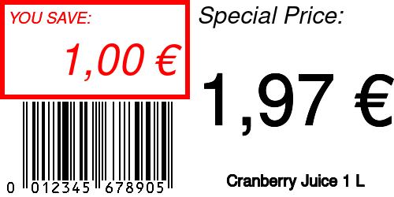

```php
<?php

use Kehet\ImagickLayoutEngine\Containers\ColumnContainer;
use Kehet\ImagickLayoutEngine\Containers\RowContainer;
use Kehet\ImagickLayoutEngine\Enums\Gravity;
use Kehet\ImagickLayoutEngine\Items\Image;
use Kehet\ImagickLayoutEngine\Items\Text;

$width = 500;
$height = 250;

$imagick = new Imagick;
$imagick->newImage($width, $height, new ImagickPixel('white'));

$root = new RowContainer();

// Left side

$column1 = new ColumnContainer();
$column1->setMarginRight(10);

$redAndItalic = draw(fill: 'red');
$redAndItalic->setFontStyle(Imagick::STYLE_ITALIC);

$cell1 = new ColumnContainer();
$cell1->setBorder(draw(stroke: 'red', strokeWidth: 5));
$cell1->setPadding(5);
$cell1->addItem(
    new Text(
        $redAndItalic,
        'YOU SAVE:',
        20,
    ),
    30
);

$cell1->addItem(
    new Text(
        $redAndItalic,
        '1,00 €',
        gravity: Gravity::RIGHT,
    )
);

$column1->addItem($cell1);
$column1->addItem(
    new Image(
        'example-ean.png'
    )
);

$root->addItem($column1);

// Right side

$column2 = new ColumnContainer();

$blackAndItalic = draw(fill: 'black');
$blackAndItalic->setFontStyle(Imagick::STYLE_ITALIC);

$column2->addItem(
    new Text(
        $blackAndItalic,
        'Special Price:',
        initialFontSize: 30,
    ),
    50
);
$column2->addItem(
    new Text(
        draw(stroke: 'black'),
        '1,97 €',
        initialFontSize: 100,
        gravity: Gravity::CENTER,
    )
);
$column2->addItem(
    new Text(
        draw(stroke: 'black'),
        'Cranberry Juice 1 L',
        initialFontSize: 20,
        gravity: Gravity::CENTER,
    ),
    40
);

$root->addItem($column2);

$root->draw($imagick, 0, 0, $width, $height);

$imagick->setImageFormat('png');
$imagick->writeImage(__DIR__ . '/price-tag.png');

```

## Output


